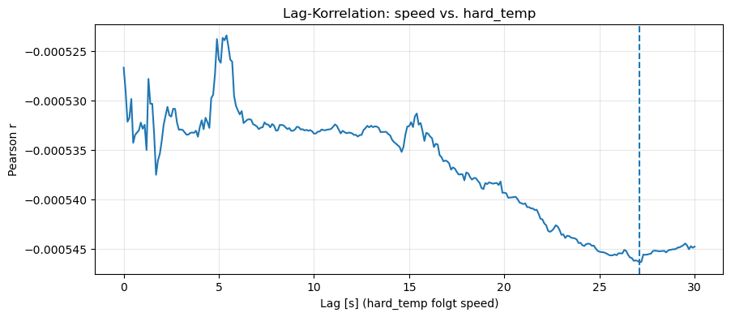
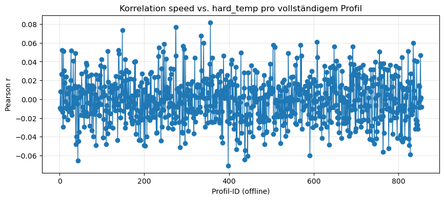
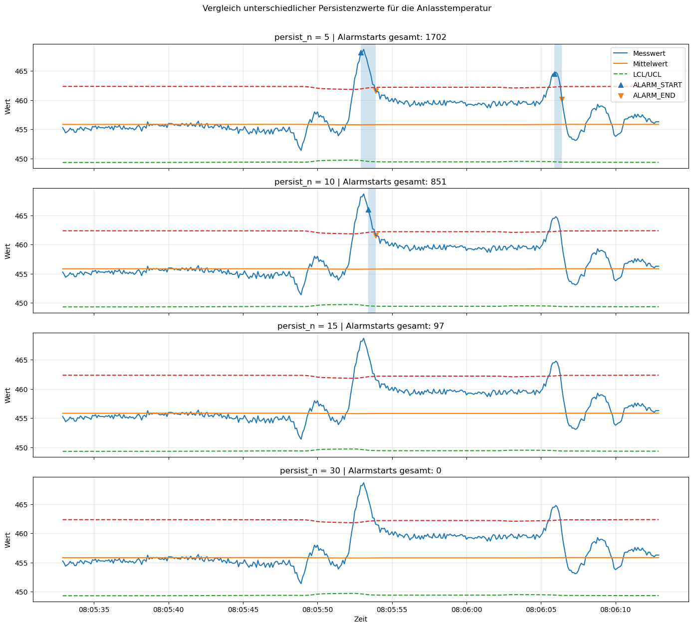
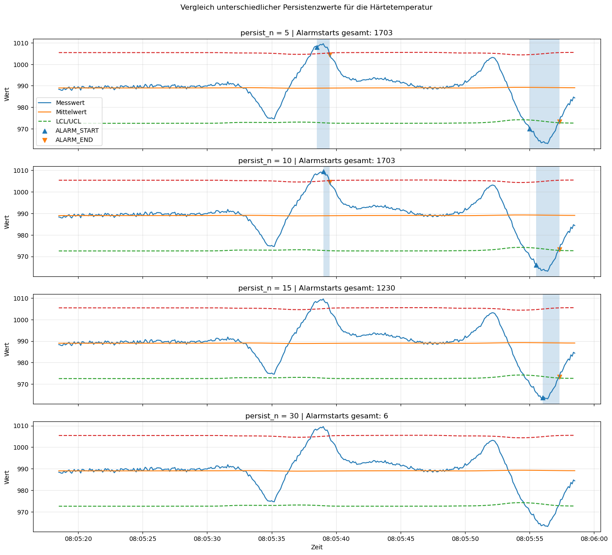
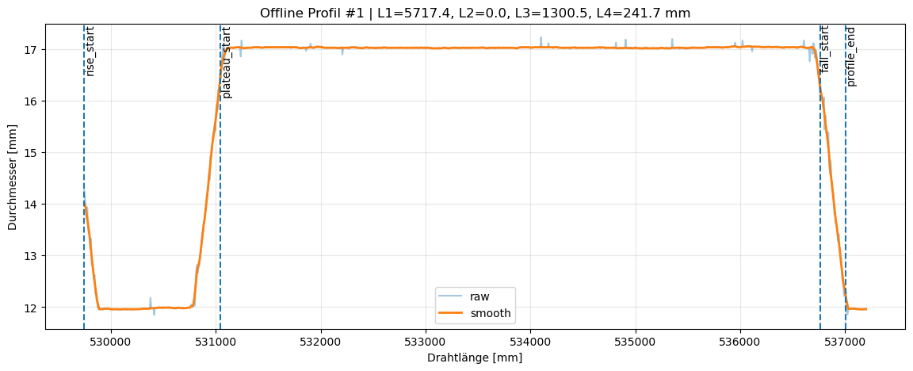
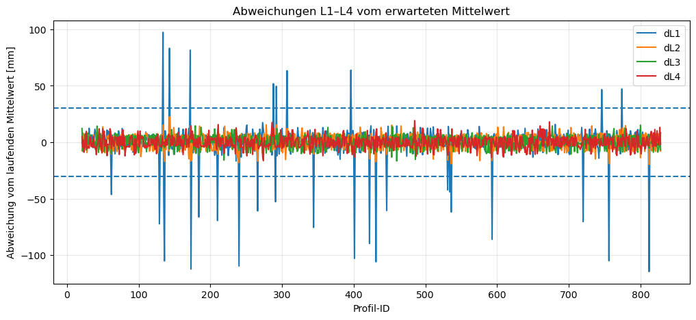
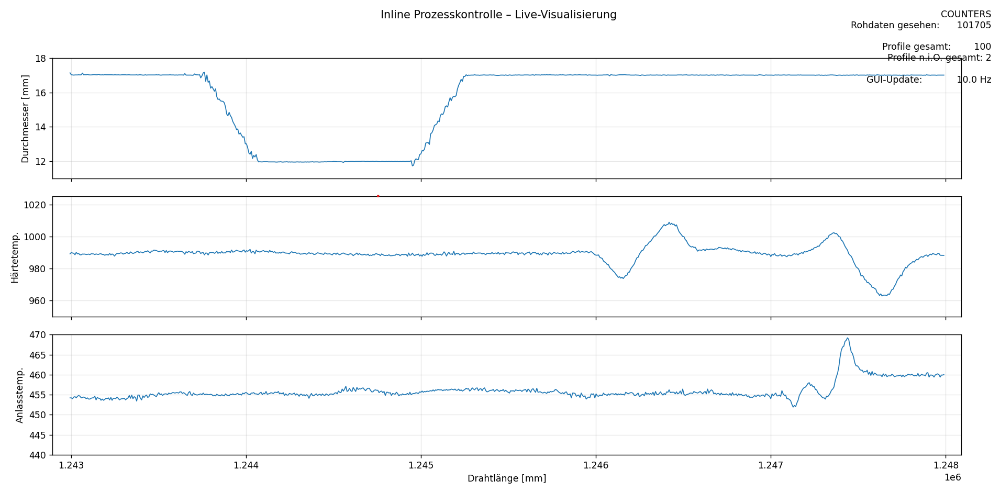

# Lösung: Inline Prozesskontrolle

Name: `Simon Jung`  

Matrikelnummer: `30400203`

# 1. Vorgehensweise und Architektur
Beschreiben Sie hier kurz wie Sie vorgegangen sind und Ihre gewählte Lösung (verwendete Bibliotheken, Struktur der Services).

Die Lösung wurde als ereignisgetriebene Streaming-Architektur aufgebaut. 
Ausgangspunkt ist ein kontinuierlicher Rohdatenstrom mit einer Abtastrate von 10 Hz. 
Für die Hausarbeit wurde dieser Datenstrom mit einem Replay-Producer aus einer 
bereitgestellten JSON-Datei simuliert und in Kafka geschrieben. Alle weiteren 
Verarbeitungsschritte konsumieren diese Daten ausschließlich aus Kafka.
Die Anwendung wurde in mehrere getrennte Services aufgeteilt. Dadurch bleiben 
die einzelnen Aufgaben fachlich sauber voneinander getrennt und können unabhängig 
voneinander entwickelt, getestet und gestartet werden. Die wichtigsten Module sind:
- Replay-Producer (`replay_producer.py`) zur Simulation des Rohdatenstroms
- Korrelationsservice (`corr_service.py`) zur Berechnung der Korrelation zwischen 
Geschwindigkeit und Härtetemperatur
- Alarmservice (`alarm_service.py`) zur Six-Sigma-basierten Schwellwerterkennung für Härtetemperatur 
und Anlasstemperatur
- Profilservice (`profile_service.py`) zur Erkennung der Drahtprofile sowie zur n.i.O.-Klassifizierung
- Visualisierung (`viz_plot_service.py`) zur Darstellung von Durchmesser, Härtetemperatur, Anlasstemperatur 
sowie der Profil- und n.i.O.-Zähler 
- weitere Hilfsprogramme zum Entpacken der Daten (`decompress_data.py`), 
anlegen der Topics (`create_topics.py`) und einige mehr, die jedoch nicht mit der 
eigentlichen Funktionalität der Anwendung in Verbindung stehen

Für die Implementierung wurden in Python unter anderem folgende Bibliotheken verwendet:
- `confluent-kafka` für Producer, Consumer und Topic-Verwaltung
- `pandas` und `matplotlib` für die Offline-Analyse und Visualisierung
- `PyYAML` für die Konfiguration
- Standardbibliotheken wie `argparse`, `collections` und `dataclasses` für CLI, 
Zustandsverwaltung und Service-Struktur

Methodisch wurde zunächst eine Offline-Analyse des Datensatzes durchgeführt, 
die in `Offline_analysis_qc.ipynb` zu finden ist. 
Dabei wurden die Signalverläufe, die Profilstruktur, die Stabilität der 
Segmentlängen, die Korrelation zwischen Geschwindigkeit und Härtetemperatur 
sowie das Verhalten der Six-Sigma-Grenzen untersucht. Die daraus gewonnenen 
Erkenntnisse wurden anschließend zur Parametrierung der Streaming-Services 
verwendet.

# 2. Korrelationsanalyse
Begründen Sie die Wahl Ihres Zeitfensters. Was waren die Herausforderungen bei der Berechnung im Stream?

## Offline Analyse und Parameteruntersuchung
Für die Untersuchung des Zusammenhangs zwischen Drahtgeschwindigkeit und 
Härtetemperatur wurde offline zunächst eine Korrelationsanalyse durchgeführt. 
Als Korrelationsmaß wurde der Pearson-Korrelationskoeffizient gewählt, 
da beide Größen metrisch sind und ein linearer Zusammenhang effizient auch 
im Stream berechnet werden kann. Die Spearmann-Korrelation ist hierbei wesentlich
rechenintersiver, da diese auf Rängen basiert, die eine Sortierung pro Fenster erfordern.
Die Offline-Analyse zeigte, dass die Geschwindigkeit 
im Datensatz nur relativ gering schwankt. Gleichzeitig ist der Prozess insgesamt 
sehr stabil. Deshalb wurde nicht nur die direkte Korrelation bei gleichem Zeitpunkt 
betrachtet, sondern zusätzlich eine Lag-Analyse durchgeführt. Dabei wurde geprüft, 
ob die Härtetemperatur der Geschwindigkeit mit zeitlicher Verzögerung folgt.
Auch unter Berücksichtigung eines zeitlichen Versatzes ergab sich kein belastbarer 
linearer Zusammenhang. Die beste gefundene Korrelation lag bei einem Zeitversatz 
von etwa 27,1 s, der zugehörige Pearson-Wert war jedoch `< +- 0,005`, 
also praktisch kein linearer Zusammenhang. Auch die Spearmann-Korrelation wurde 
der Vollständigkeithalber untersucht, lieferte aber nur Werte nahe 0.

Daraus wurde geschlossen, 
dass im vorliegenden Datensatz kein sinnvoll nutzbarer linearer Zusammenhang 
zwischen Geschwindigkeit und Härtetemperatur nachweisbar ist.

Für die Fensterwahl wurde die zuvor aus der Profilanalyse abgeleitete typische 
Profilperiode herangezogen. Ein vollständiges Profil dauert im Mittel etwa 
101 s und umfasst ungefähr 1012 Rohwerte. Auch hier zeigt sich kein Zusammenhang 
(`r_max = 0,08`). 

Deshalb wurde für die Live-Analyse 
ein Korrelationsfenster gewählt, das ungefähr einer Profilperiode entspricht. 
Dadurch wird ein fachlich sinnvoller lokaler Zusammenhang untersucht, ohne zu 
stark über mehrere Profile zu mitteln.

## Umsetzung im Stream-Prozess
Die Korrelationsanalyse wurde als eigener Streaming-Service umgesetzt. 
Der Service konsumiert die Rohdaten aus Kafka und führt für jedes Gerät ein 
gleitendes Fenster von `n = 1000` über Geschwindigkeit und Härtetemperatur. 
Aus diesem Fenster wird fortlaufend der Pearson-Korrelationskoeffizient berechnet und 
in ein separates Kafka-Topic `1031103_corr` geschrieben. Da die Offline-Analyse 
bereits gezeigt hat, 
dass die Korrelation im Datensatz sehr gering ist, wurde das Ergebnis 
im Live-System bewusst nicht als Alarm, sondern als fortlaufender Analysewert 
behandelt. Zusätzlich werden im Ausgabeevent auch die Streuungen von Geschwindigkeit 
und Härtetemperatur im aktuellen Fenster ausgegeben. Das ist wichtig, weil der 
Pearson-Koeffizient bei sehr kleiner Varianz wenig aussagekräftig sein kann.

Die Live-Implementierung dient damit nicht primär der Alarmierung, sondern 
der kontinuierlichen quantitativen Bewertung, ob im laufenden Prozess ein 
linearer Zusammenhang zwischen Geschwindigkeit und Härtetemperatur vorliegt. 
Im vorliegenden Datensatz bestätigte die Online-Berechnung die Offline-Ergebnisse. 
Die Korrelation blieb durchgehend sehr klein und zeigte keinen stabilen 
linearen Zusammenhang.

# 3. Schwellwerterkennung (Six Sigma)
Wie haben Sie die "Running Statistics" (Mittelwert/StdDev) implementiert? 
Wie gehen Sie mit der Initialisierung um?

## Offline Analyse
Für die Schwellwerterkennung wurden die beiden Prozessgrößen Härtetemperatur 
und Anlasstemperatur offline mit einem Six-Sigma-Verfahren untersucht. 
Ziel war es, eine Fenstergröße und eine Alarmlogik zu finden, die auch im 
laufenden Betrieb sinnvoll eingesetzt werden kann. Als Grundlage wurde ein 
gleitendes Fenster von 5 Minuten gewählt. Bei einer Abtastrate von 10 Hz 
entspricht dies 3000 Messwerten. Für jeden neuen Messwert wurden Mittelwert und 
Standardabweichung aus dem vorherigen Fenster berechnet. Die Eingriffsgrenzen 
ergeben sich dann aus:

- Untergrenze = Mittelwert − 3 · Standardabweichung
- Obergrenze = Mittelwert + 3 · Standardabweichung

Die ersten 3000 Werte wurden als Anlaufphase behandelt. 
In dieser Zeit wird die Statistik aufgebaut, aber es wird noch kein Alarm 
ausgelöst. Im Realbetrieb könnte man hier auf globale Mittelwerte aus vorangegangenen 
Werten zurückgreifen.
In einem ersten Test wurde jeder einzelne Grenzwertverstoß sofort 
betrachtet. Die Offline-Analyse zeigte jedoch, dass dies zu sehr vielen kurzen 
Alarmen führt. Deshalb wurde zusätzlich eine Persistenzbedingung untersucht. 
Ein Alarm wird dabei erst dann ausgelöst, wenn mehrere aufeinanderfolgende Werte 
außerhalb der Eingriffsgrenzen liegen. 

Es wurden verschiedene Werte für die Persistenz getestet 
(persist_n = 5, 10, 15, 30). Die Auswertung desselben Signalausschnitts zeigte:

Anlasstemperatur:

Härtetemperatur:

Schlussfolgerung:
- kleine Persistenzwerte führen zu sehr vielen kurzen Alarmen
- große Persistenzwerte unterdrücken kurze Ausschläge deutlich
- persist_n = 30 ist bereits sehr streng und blendet insbesondere bei der 
Anlasstemperatur fast alle Ereignisse aus
- persist_n = 15 stellt einen sinnvollen Kompromiss zwischen Empfindlichkeit und Stabilität dar.

Damit wurde für die Live-Anwendung entschieden:
- Fenstergröße: 5 Minuten
- Anlauffenster: 5 Minuten
- Persistenz: 15 aufeinanderfolgende Grenzwertverletzungen

Bei 10 Hz entspricht persist_n = 15 einer Zeit von 1,5 Sekunden. 
Ein Alarm wird also nur dann ausgelöst, wenn eine Abweichung nicht nur kurzzeitig, 
sondern über einen etwas längeren Zeitraum anhält. Diese Größe ist jedoch stark von
den internen Qualitätsvorgaben abhängig.

## Umsetzung im Stream-Prozess
Die Schwellwerterkennung wurde als eigener Streaming-Service umgesetzt. 
Der Service konsumiert kontinuierlich die Rohdaten aus Kafka und überwacht 
dabei Härtetemperatur und Anlasstemperatur getrennt.
Für jede Messgröße wird ein eigenes gleitendes Fenster geführt. Aus diesem Fenster 
werden fortlaufend Mittelwert und Standardabweichung berechnet. 
Wichtig ist dabei, dass der aktuelle Messwert zuerst gegen die 
Statistik des bisherigen Fensters geprüft und erst danach in das Fenster 
aufgenommen wird. Dadurch beeinflusst ein möglicher Ausreißer nicht sofort 
seine eigene Bewertung. Wird die Eingriffsgrenze über mindestens 15 
aufeinanderfolgende Werte verletzt, erzeugt der Service ein Alarmereignis und 
sendet dieses in das Kafka-Topic `1031103_801` für Alarme. Sobald der Messwert wieder 
innerhalb der berechneten Grenzen liegt, wird ein entsprechendes 
"Alarm-Ende-Ereignis" erzeugt. Die Schwellwerterkennung erfolgt vollständig im 
Stream und ohne nachgelagerte Batch-Auswertung. Gleichzeitig reduziert die zusätzliche 
Persistenzbedingung die Zahl kurzer Fehlalarme deutlich und macht die 
Alarmierung für eine Inline-Kontrolle wesentlich robuster.

# 4. Profilerkennung
Beschreiben Sie Ihren Algorithmus zur Segmentierung der Daten. Wie erkennen Sie "Knees" (Start/Ende von Plateaus)?

Zur Erkennung der Drahtprofile wurde ein zustandsbasierter Algorithmus 
(Finite State Machine) verwendet. Ein vollständiges Profil besteht aus 
den vier Segmenten LOW, RISE, HIGH und FALL und wird erst dann als erkannt 
gezählt, wenn die Folge LOW -> RISE -> HIGH -> FALL -> LOW vollständig 
durchlaufen wurde. Dadurch können die Segmentlängen L1 bis L4 eindeutig 
aus den Drahtlängen an den Zustandswechseln berechnet werden.

Die Erkennung der Knees (Beginn und Ende der Plateaus bzw. Übergänge)
erfolgt über Schwellwerte mit Hysterese auf dem geglätteten Durchmessersignal.
Verwendet wurden die Grenzen `low_entry`, `low_exit`, `high_entry` 
und `high_exit`. Der Übergang von LOW nach RISE wird nur dann zugelassen, 
wenn zuvor ein stabiler LOW-Bereich erkannt wurde und zusätzlich 
eine positive lokale Steigung vorliegt. Dadurch wird verhindert, 
dass ein Profilstart mitten in einem Übergang fälschlich erkannt wird.

Ausgangspunkt war eine einfache FSM mit festen Schwellwerten auf dem Rohsignal.
Die Offline-Analyse zeigte jedoch, dass diese Variante an Start- und 
Randbereichen fehleranfällig war. Es traten unplausible Segmentierungen auf, 
etwa `L2 = 0 mm`. Ursache war, dass der Stream an 
beliebiger Stelle beginnen kann und die FSM dadurch nicht immer korrekt auf 
einen LOW-Zustand synchronisiert war. Im Folgenden ist ein 
fehlerhaft segmentiertes Profil dargestellt. 

Deshalb wurde die Profilerkennung 
erweitert um:
- eine Synchronisationsphase (UNSYNCED)
- eine Glättung des Durchmessersignals
- eine Steigungsbedingung für den Start des Anstiegs
- einen Plausibilitätsfilter für erkannte Profile

Die Offline-Analyse ergab für die plausiblen Profile sehr stabile Werte:
- L1 ca. 5723 mm
- L2 ca. 962 mm
- L3 ca. 226 mm
- L4 ca 229 mm
- Gesamtprofil ca. 7140 mm
- Dauer ca. 101 s
- ca. 1012 Rohwerte pro Profil

Damit erwies sich der FSM-Ansatz als gut geeignet für die Streaming-Aufgabe. 
Die größte Herausforderung lag nicht in der Rechenzeit, sondern in der 
robusten Initialisierung und Synchronisation des Zustands.

## n.i.O-Klassifizierung der Profile
Nach robuster Profilerkennung und Plausibilitätsfilterung wurden 828 
gültige Profile identifiziert. Nach einer Anlaufphase von 20 Profilen 
wurden 808 Profile gegen den laufenden Mittelwert geprüft. 
31 Profile wurden als n.i.O. klassifiziert. In allen n.i.O.-Fällen war 
ausschließlich die Länge L1 außerhalb der Toleranz von ±30 mm, 
während L2, L3 und L4 innerhalb der zulässigen Abweichung blieben. 
Daraus lässt sich schließen, dass die größte Variabilität im Datensatz 
im Bereich des Plateaus liegt. Im Folgenden ist die Toleranzabweichung 
über die Profil-IDs dargestellt.

Die n.i.O.-Klassifizierung wurde direkt in den Streaming-Service zur 
Profilerkennung integriert. Nachdem ein vollständiges Profil erkannt und 
die Segmentlängen L1 bis L4 berechnet wurden, wird das Profil zunächst auf 
Plausibilität geprüft. Nur gültige Profile werden anschließend für die 
weitere Bewertung verwendet. Für die Bewertung wird je Segmentlänge ein 
laufender Mittelwert über die bisher erkannten gültigen Profile geführt 
(5 Werte zur leichten Glättung).
Eine Anlaufphase von 20 Profilen verhindert, dass instabile Anfangswerte 
zu Fehlklassifikationen führen. Ein Profil wird als n.i.O.
eingestuft, wenn mindestens eine der vier Längen um mehr als +-30 mm vom 
erwarteten Mittelwert abweicht. In der Live-Anwendung werden dabei die 
Abweichungen für L1, L2, L3 und L4 einzeln berechnet und ausgewertet.
Alle als gültig erkannten Profile werden in das Kafka-Topic `1031103_profiles` 
geschrieben. 
Wird zusätzlich eine Abweichung erkannt, erzeugt der Service ein eigenes 
n.i.O.-Ereignis und sendet dieses in das separate Kafka-Topic:
`1031103_profiles_nio`

Das n.i.O.-Ereignis enthält unter anderem den Zeitstempel, 
die Maschinen-ID, die Profil-ID, die gemessenen Segmentlängen, 
die erwarteten Mittelwerte sowie die berechneten Abweichungen. 
Dadurch können nachgelagerte Module diese Ereignisse direkt aus 
Kafka konsumieren, ohne eng an die Profilerkennung gekoppelt zu sein.

## Visualisierung

Die Visualisierung wurde als eigenes Streaming-Modul umgesetzt und konsumiert ihre Daten 
ausschließlich aus Kafka. Damit bleibt sie von der eigentlichen Analyse- und Erkennungslogik 
entkoppelt. Die Visualisierung liest zwei Arten von Informationen:
- Rohdaten aus dem Topic raw (`1031103_1000`), um die Verläufe von Durchmesser, Härtetemperatur 
und Anlasstemperatur jeweils über der Drahtlänge darzustellen
- Ereignisdaten aus den Topics profiles (`1031103_profiles`) und profiles_nio (`1031103_profiles_nio`),
um zusätzlich die Gesamtzahl  erkannter Profile und die Anzahl der n.i.O.-Profile anzuzeigen

Für die Darstellung wurde ein gleitendes Sichtfenster über der Drahtlänge verwendet. 
Dadurch werden nur die letzten relevanten Prozessdaten angezeigt, was die Visualisierung 
auch bei kontinuierlichem Streaming stabil und reaktionsfähig hält. Die Aktualisierung 
erfolgt mit einer begrenzten Bildrate, damit die Anzeige flüssig bleibt und der Kafka-Consumer 
nicht durch unnötig häufiges Neuzeichnen ausgebremst wird. Ein wichtiger Punkt war die 
saubere Trennung zwischen laufender Rohdatenvisualisierung und diskreten Ereignissen. 
Die Rohdaten werden direkt aus dem Rohdaten-Topic geplottet, während die Profil- 
und n.i.O.-Zähler aus den von der Profilerkennung erzeugten Kafka-Events stammen. 

# 5. Ergebnisse
Fügen Sie hier Logs ein, die zeigen, dass Ihr System Anomalien erkennt. 
Wie bewerten Sie die Umsetzbarkeit von Echtzeit-Analysen im Bereich 
der Inline-Kontrolle für Mubea. Welche Änderungen müssten an der 
Ihnen bekannten Architektur vorgenommen werden? 
Welche Hürden sehen Sie?

Die entwickelte Lösung konnte die drei Analysebausteine unter Streaming-Bedingungen 
erfolgreich umsetzen. Die Rohdaten wurden kontinuierlich über Kafka verarbeitet, ohne dass 
eine nachgelagerte Batch-Auswertung notwendig war. Alle Analyseergebnisse wurden als eigene 
Kafka-Ereignisse bereitgestellt und konnten dadurch von weiteren Modulen, insbesondere der 
Visualisierung, direkt konsumiert werden. 

Im Bereich der Profilerkennung wurden nach robuster 
Segmentierung und Plausibilitätsprüfung 828 gültige Profile erkannt. Nach einer Warm-up-Phase 
von 20 Profilen wurden 808 Profile gegen den laufenden Mittelwert bewertet. Davon wurden 
31 Profile als n.i.O. klassifiziert. Die Abweichungen 
traten im vorliegenden Datensatz ausschließlich bei der Segmentlänge L1 auf, während L2, L3 
und L4 innerhalb der Toleranz von +-30 mm blieben. Zusätzlich wurden n.i.O.-Profile als eigene 
Ereignisse in das Kafka-Topic `1031103_profiles_nio` geschrieben.

Die Schwellwerterkennung für Härtetemperatur und Anlasstemperatur wurde auf Basis 
eines 5-Minuten-Fensters umgesetzt. Die Offline-Analyse zeigte, dass eine reine Punktbewertung 
zu sehr vielen kurzen Alarmen führte. Deshalb wurde für die Live-Anwendung zusätzlich eine 
Persistenzbedingung eingeführt. Dadurch wurde die Alarmierung robuster gegenüber kurzzeitigen 
Grenzverletzungen und sind damit besser für eine Inline-Kontrolle geeignet. Die Zulässigkeit
der Persistenz hängt jedoch stark von den Qualitätsanforderungen bei Mubea ab.

Die Korrelationsanalyse zwischen Geschwindigkeit und Härtetemperatur ergab sowohl offline als 
auch im Streaming-Betrieb nur sehr geringe Werte. Damit konnte im vorliegenden Datensatz kein 
belastbarer linearer Zusammenhang nachgewiesen werden.

Die Umsetzung in Echtzeit ist für die gegebene Datenrate von 10 Hz grundsätzlich gut mit
dieser Architektur umsetzbar. 
Die größte Herausforderung lag in der robusten Zustandsführung, 
der Initialisierung von gleitenden Statistiken, der Behandlung von Randfällen bei der 
Profilerkennung und der Vermeidung von Fehlalarmen. Für einen produktiven Einsatz bei 
Mubea wären insbesondere folgende Erweiterungen sinnvoll:
- persistente Zustände bzw. Checkpointing für laufende Fenster und Zustandsautomaten
- Monitoring der Services und Kafka-Consumer-Lags
- konfigurierbare Parameter je Produkt
- zusätzliche Topics für Zustandsinformationen, z. B. aktuellen Profilstatus
- ein strukturiertes Handling von Alarmen

Als wesentliche Hürden sind driftende Referenzwerte, Neustarts laufender 
Services sowie die Trennung zwischen relevanten Alarmen und kurzzeitigen 
Signalabweichungen zu sehen. Insgesamt zeigt die Arbeit jedoch, dass eine Inline-Kontrolle 
mit Streaming-Technologien für den betrachteten Anwendungsfall grundsätzlich umsetzbar ist.

## Logs
### Korrelationsanalyse
Zur Demonstration der Funktionalität wurde der Replay mit maximaler Geschwindigkeit
durchlaufen und die Topics `1031103_corr` für die Korrelation mitgelesen. Im Folgenden
eine Ausschnitt der Logs:

### Schwellwerterkennung und Ereignisgetriebene Alarmierung
Zur Demonstration der Funktionalität wurde der Replay mit maximaler Geschwindigkeit
durchlaufen und die Topics `1031103_801` für die Alarmierung mitgelesen. Im Folgenden
eine Ausschnitt der Logs:

### Profilerkennung und n.i.O.-Klassifizierung
Zur Demonstration der Funktionalität wurde der Replay mit maximaler Geschwindigkeit
durchlaufen und die Topics `1031103_profiles` und `1031103_profiles_nio` ausgegeben.

